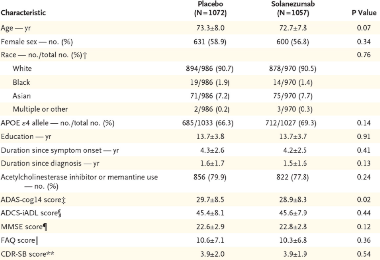

```{r child="../00_supp/general_rmd.Rmd"}
```


# Giới thiệu  

 _Matching-adjusted indirect comparison (MAIC)_ là một phương pháp so sánh gián tiếp hai nhóm điều trị mà ta không có số liệu trực tiếp. Ví dụ khách hàng của ta là hãng thuốc A, có data của 2 nhóm bệnh nhân được điều trị bằng thuốc A và thuốc B (B cũng có thể xem là placebo [giả dược]). Mục tiêu của họ là so sánh hiệu quả của thuốc A và thuốc C (thuộc công ty đối thủ). Mặc dù ta không có số liệu nào về thuốc C nhưng ta có thể tìm thấy những bài báo cho kết quả so sánh của thuốc C và 1 loại khác. Nếu như loại thuốc được sử dụng để so sánh với thuốc C là B thì đươc xem là điều kiện lý tưởng để thực hiện phương pháp so sánh gián tiếp, so sánh này được gọi là _so sánh tương xứng (anchored comparison)_ . Trong trường hợp loại thuốc được chọn là D, ta thấy rằng giữa 2 nghiên cứu này không sử dụng cùng một loại thuốc so sánh (là B), thì so sánh này được gọi là _so sánh bất tương xứng (unanchored comparison)_, xem hình \@ref(fig:diagram). Hình thức so sánh thứ hai đòi hỏi nhiều giả thuyết hơn loại thứ nhất, vì thế chỉ trong trường hợp so sánh đối xứng không thể thực hiện được thì ta mới xem xét đến loại so sánh bất đối xứng. Trong bài hiện tại, ta sẽ làm quen với phương pháp so sánh đối xứng, loại so sánh thứ hai có thể sẽ được giới thiệu trong những phần tiếp theo.  
 
```{r diagram, fig.cap="_(trái) so sánh đối xứng; (phải) so sánh bất đối xứng_"}
node = tibble(x = c(0.1,0.3,0.5), y = c(0.2,0.5,0.2), name = c("A","B","C"))
from = c("A","B","C")
to = c("B","C","A")
edge = tibble(from,to,
   x.from = node$x[match(from,node$name)],
   y.from = node$y[match(from,node$name)],
   x.to = node$x[match(to,node$name)],
   y.to = node$y[match(to, node$name)],
   lt = c("dashed","dashed","dotted")
)

add_text = tibble(
   x = c(0.15,0.3,0.4), y = c(0.35,0.25,0.35),
   lab = c("so sánh trực tiếp\n có IPD\n(đã thực hiện)","so sánh gián tiếp\n(đang thực hiện)","so sánh trực tiếp\nchỉ có SLD\n(đã thực hiện)")
)

g1<- ggplot()+
   geom_segment(data = edge, aes(x = x.from, y = y.from, xend = x.to, yend = y.to,linetype = lt),show.legend = F, color = "grey")+
   geom_point(data = node, aes(x = x,y),size = 25, color = "pink")+
   geom_text(data = node, aes(x = x,y = y, label=name), size = 8)+
   geom_text(data = add_text, aes(x,y,label = lab), size = 4)+
   theme_void()+
   xlim(c(0,0.6))+ ylim(c(0,0.6))
####
####
####

node = tibble(x = c(0.1,0.3,0.5, 0.7), y = c(0.2,0.5,0.2,0.5), name = c("A","B","C","D"))
from = c("A","C","C")
to = c("B","D","A")
edge = tibble(from,to,
   x.from = node$x[match(from,node$name)],
   y.from = node$y[match(from,node$name)],
   x.to = node$x[match(to,node$name)],
   y.to = node$y[match(to, node$name)],
   lt = c("dashed","dashed","dotted")
)

add_text = tibble(
   x = c(0.2,0.3,0.6), y = c(0.35,0.25,0.35),
   lab = c("so sánh trực tiếp\n có IPD\n(đã thực hiện)","so sánh gián tiếp\n(đang thực hiện)","so sánh trực tiếp\nchỉ có SLD\n(đã thực hiện)")
)

g2<- ggplot()+
   geom_segment(data = edge, aes(x = x.from, y = y.from, xend = x.to, yend = y.to,linetype = lt),show.legend = F, color = "grey")+
   geom_point(data = node, aes(x = x,y),size = 25, color = "violet")+
   geom_text(data = node, aes(x = x,y = y, label=name), size = 8)+
   geom_text(data = add_text, aes(x,y,label = lab), size = 4)+
   theme_void()+
   xlim(c(0,0.8))+ ylim(c(0,0.6))
  
gridExtra::grid.arrange(g1,g2, ncol = 2)

```

Khi thực hiện các phương pháp so sánh thống kê, để giảm độ lệch (biasedness) ta thường mong muốn cân bằng các đơn vị (units) sao cho một số đại lượng thống kê giữa hai nhóm điều trị xấp xỉ nhau. Nói cách khác ta giảm tính khác biệt giữa hai nhóm bệnh nhân trên các biến được quy định trước điều trị (pretreatment hay baseline). Ví dụ ta thường bắt gặp các thông tin như tuổi, giới tính, dân tộc... của bệnh nhân thuộc hai nhóm điều trị khác nhau, như thế để tăng độ chính xác khi so sánh, các bệnh nhân thuộc 2 nhóm điều trị phải có các trị số về tuổi, giới tính, dân tộc tương đồng nhau (điều này tuân thủ theo các giả thuyết trong lý thuyết về _suy luận nguyên nhân (casual inference)_. Thông thường, ta sẽ gặp 2 loại biến cơ bản là biến liên tục và biến rời rạc. Biến liên tục được sử dụng cho tuổi, các trị số bệnh lý, trong khi biến rời rạc lại được sử dụng cho giới tính, dân tộc, vùng miền. Đối với biến liên tục ta thường quan tâm tới 2 trị số thống kê là _kỳ vọng_ và _phương sai_, còn biến rời rạc là _tỉ lệ nhóm_, ví dụ tỉ lệ nam, tỉ lệ nữ.

Đối với data bao gồm loại thuốc A và thuốc B (data của khác hàng), ta sẽ có thông tin đầy đủ về các biến liên tục và rời rạc của từng bệnh nhân, data loại này gọi là _data chi tiết [individual paticipant data (IPD)]_. Trong khi các thông tin của thuốc C và B mà ta thu thập được từ một bài báo khoa học nào đó thì chỉ có các đại lượng thống kê như kỳ vọng, trung vị và phương sai của biến liên tục, và các tỉ lệ của biến rời rạc, được gọi là _data tổng hợp [summarized level data (SLD) or aggregate data]_. Hình (\@ref(fig:sample-SLD)) là một ví dụ của SLD.

```{r sample-SLD, echo=FALSE, out.width = '90%', fig.cap="_một ví dụ của các biến trước điều trị trong một bài báo khoa học_"}
 
```

Để minh họa cho IPD, ta hãy xem xét hình (\@ref(fig:IPD))

```{r IPD, echo=FALSE, fig.cap="_một ví dụ của individual participant data_"}
df = read.csv("dataset.csv")%>%
   mutate(time = anh$help_nice_form(time, digits = 4))

draw_table(df)
```

ở đây ta thấy rằng mỗi bệnh nhân thuộc nhóm điều trị A và B đều có thông tin đầy đủ ở cả 2 biến _age_ và _gender_. Ta có thể tóm tắc 2 biến này như trong hình (\@ref(fig:sum-IPD)) 


```{r sum-IPD, echo=FALSE, fig.cap= "_Bảng tóm tắc các đại lượng thống kê của hai biến age và gender của IPD_"}
l = list(
   vars = c("age", "gender (male)")
)

l$mean<- c(mean(df$age), NA)
l$p<- c(NA, mean(df$gender=="Male"))
l$variance = c(var(df$age), l$p[2]%>%{.*(1-.)*nrow(df)})

as_tibble(l)%>%
   mutate(across(where(is.numeric), anh$help_nice_form))%>%
   mutate(across(.fns = ~ifelse(is.na(.),"",anh$help_nice_form(.))))%>%
   draw_table()
```

Ngoài ra, dựa vào hình (\@ref(fig:sample-SLD)) ta có thể dễ dàng tính được số tuổi trung bình và tỉ lệ nam như trong hình (\@ref(fig:sum-SLD))


```{r sum-SLD, echo=FALSE, fig.cap= "_Bảng tóm tắc các đại lượng thống kê của hai biến age và gender của SLD_"}
l = list(
   vars = c("age", "gender (male)")
)

l$mean<- c((73.3*1072+72.7*1057)/(1072+1057), NA)
l$p<- c(NA, (1072-631 + 1057-600)/(1072+1057))
l$variance = c(NA, l$p[2]%>%{.*(1-.)*nrow(df)})

as_tibble(l)%>%
   mutate(across(where(is.numeric), anh$help_nice_form))%>%
   mutate(across(.fns = ~ifelse(is.na(.),"",anh$help_nice_form(.))))%>%
   draw_table()
```

Như vậy, ta thấy rằng kỳ vọng của biến _age_  và tỉ lệ _male_ giữa IPD và SLD không bằng nhau, nếu ta tiến hành so sánh thì kết quả có khả năng lệch rất cao. Vì thế mục tiêu chúng ta là làm cách nào để những biến trên sẽ xấp xỉ nhau giữa IPD và SLD. 

Một lưu ý nhỏ là trong SLD hiện tại, thông tin về phương sai của biến _age_ không được cung cấp nên ta sẽ bỏ qua đại lượng này. Ngoài ra, đối với biến rời rạc, ta không cần quan tâm tới variance, bởi vì ta sẽ giả sử biến này tuân thủ phân phối đa thức (multinomial) nếu có nhiều hơn 2 nhóm, trong ví dụ hiện tại sẽ là phân phối nhị thức (binomial). Và ta biết rằng kỳ vọng và phương sai của phân phối nhị thức đều là hàm số của tham số $p$ \@ref(eq:1), nghĩa là nếu một trong hai đại lượng được cân bằng, thì đại lượng còn lại cũng sẽ được cân bằng. Để hiểu thêm ta có thể tham khảo tại các nguồn @jam2012, @phil2017 và @sig2010.

$$
\begin{aligned}
X &\sim \mathcal{Bin}(n,p) \\
&\Rightarrow \E(X) = np \\
&\Rightarrow \V(X) = np(1-p) ~~~~\textit{(n is fixed)}
\end{aligned}
(\#eq:1)
$$
 
# Phương pháp

Để tiến hành so sánh ta thực hiện qua 3 bước 

1. So sánh không cân xứng không điều chỉnh (unmatched & unadjusted comparison hay còn gọi là naive comparison hoặc Bucher comparison)
2. So sánh cân xứng không điều chỉnh (matched & unadjusted comparison)
3. So sánh cân xứng có điều chỉnh (matched and adjusted comparison)

## So sánh không cân xứng không điều chỉnh

Đối với loại so sánh này, ta sẽ so sánh trực tiếp các đại lượng đánh giá hiệu quả của cả hai nghiên cứu. Ví dụ đại lượng ta muốn so sánh là _odd ratio_ được định nghĩa như sau 

$$
OR = \frac{odd_1}{odd_2} =\frac{p_1/(1-p_1)}{p_2/(1-p_2)}
$$
Đối với loại so sánh đối xứng điều này có thể dễ dàng nhận thấy, ví dụ đối với SLD, ta có $\ln(OR_{CB}) = \ln(odd_C) - \ln(odd_B)$, với IPD sẽ là $\ln(OR_{AB}) = \ln(odd_A) - \ln(odd_B)$. Như vậy  

$$
\begin{aligned}
\ln(OR_{AC}) &= \ln(OR_{AB}) - \ln(OR_{CB}) \\
&= \ln(odd_A) - \ln(odd_B) - \ln(odd_C) + \ln(odd_B) \\
&= \ln(odd_A) -  \ln(odd_C)
\end{aligned}
$$

trong đó $\ln(OR_{AC})$ chính là _odd ratio_ của A và C, cũng chính là đại lượng ta muốn tìm. Trong loại so sánh này rõ ràng ta đã không xem xét các biến trước điều trị.

## So sánh cân xứng không điều chỉnh

Loại so sánh này cũng tương tự như loại một, nhưng ta cần chọn lọc và loại bỏ đi những bệnh nhân nằm ngoài phạm vi xem xét của SLD. Ví dụ trong bài báo khoa học ta thu thập được có đề cập về giới hạn độ tuổi của bệnh nhân tham gia vào nghiên cứu là từ $50$ tới $80$, trong khi đó các bệnh nhân tham gia trong IPD là từ $40$ tới $80$, như vậy ta cần loại bỏ đi tất cả các bệnh nhận dưới $50$ tuổi. Một lưu ý ta cần xem xét là phạm vi của SLD phải luôn nhỏ hơn phạm vi của IPD, điều này cho phép ta cắt bớt các quan sát từ IPD để làm cho hai data cân đối. Trong trường hợp ngược lại, ví dụ số tuổi của các bệnh nhân trong IPD là từ $50$ tới $70$, ta sẽ không thể nào cân xứng được giữa 2 data, vì ta không có dữ kiện của từng bệnh nhân trong SLD.

Sau khi 2 data đã được cân xứng, ta tiến hành tính $OR_{AB}$ và so sánh với $OR_{CB}$ như so sánh loại I. 

## So sánh cân xứng có điều chỉnh

Ở loại so sánh này, ta sẽ sử dụng IPD đã được cân xứng với SLD và tiến hành điều chỉnh các biến trước điều trị. Trước tiên ta cần xử lý các biến rời rạc bằng cách tạo ra các biến nhị thức. Ví dụ nếu  biến rời rạc $X$ có $4$ nhóm $A,B,C$ và $D$ thì ta sẽ tạo thành 3 biến nhị thức $\{X_i\}_{i=1}^3$ mang giá trị $0$ hoặc $1$. Như vậy 

- Bệnh nhân thuộc nhóm $A$ sẽ có giá trị $(1,0,0)$
- Bệnh nhân nhóm $B$ có giá trị $(0,1,0)$
- Bệnh nhân nhóm $C$ có giá trị $(0,0,1)$

nhóm $D$ được xem là nhóm liên đới (reference), nghĩa là nếu giá trị của 3 biến $\{X_i\}_{i=1}^3$ đều là $0$ thì bệnh nhân đó thuộc nhóm $D$. Quy ước tương tự nếu ta chọn nhóm reference là một trong ba nhóm $A,B,C$. 

Trong ví dụ về biến _gender_, vì chỉ có 2 nhóm _Male_ và _Female_ nên ta chỉ cần một biến nhị thức để biểu diễn như hình (\@ref(fig:codehot))

```{r codehot, fig.cap="_IPD sau khi xử lý biến rời rạc_"}
df = mutate(df, gender = ifelse(gender == "Male",1,0))
draw_table(df)
```

Ta xem lại 2 bảng (\@ref(fig:sum-IPD)) và (\@ref(fig:sum-SLD)), liệu giá trị _kỳ vọng_ và _tỉ lệ nhóm_ của hai data này có khả năng điều chỉnh được không? để trả lời câu hỏi này ta cần xem xét các giá trị cực đại và cực tiểu của 2 biến trong IPD. 

```{r}
df[,c("age","gender")]%>% summary()
```

Ta thấy rằng giá trị cực tiểu và cực đại của _age_ lần lượt là $50$ và $65$, trong khi đó kỳ vọng của _age_ trong SLD là $73$, nằm ngoài tập giá trị của biến này trong IPD. Trong trường hợp này, ta không thể nào cân bằng được. để hiểu tại sao không thể ta hãy xem xét công thức tính kỳ vọng như sau 

$$
\mu = \frac{\sum_{i=1}^n x_i}{n} = \sum_{i=1}^n\frac{1}{n}x_i = \sum_{i=1}^n p_ix_i
(\#eq:2)
$$
dựa theo công thức \@ref(eq:2) ta thấy rằng mỗi một giá trị $x_i$ đều có 1 tỉ trọng đóng góp là $p_i$, thông thường thì tỉ trọng đóng góp này của các giá trị trong cùng một mẫu là như nhau, nghĩa là $1/n$. Như vậy để điều chỉnh giá trị $\mu_{IPD}$ trong SLD bằng với $\mu_{SLD}$, ta cần phải điều chỉnh các giá trị $p_i$. Ví dụ, xem xét dãy số $\{1,3,5,8,9\}$, ta tính được trung vị của dãy số này là 

$$
\mu = 0.2(1+3+5+8+9)= 5.2
$$

Nếu ta muốn lấy $\mu = 7.7$ ta cần phải điểu chỉnh $\{p_i|i=1,\dots,n\}$ sao cho _bình quân gia quyền (weighted mean)_ $\sum p_ix_i$ bằng giá trị mà ta mong muốn. Như vậy nếu các $p_i$ lần lượt là $\{0.05, 0.05, 0.1, 0.2, 0.6\}$ thì ta sẽ có 

$$
\mu = 0.05*(1) + 0.05*(3)+ 0.1*(5)+0.2*(8)+ 0.6*(9) = 7.7
$$
 Ta nhận thấy rằng, $p_i$ của các giá trị càng xa giá trị $7.7$ thì càng nhỏ, ngược lại các $p_i$ của các giá trị càng gần $7.7$ sẽ càng lớn, ta có thể hiểu nôm na là các giá trị càng xa thì đóng góp càng ít và các giá trị càng gần sẽ đóng góp càng nhiều. Như vậy rõ ràng nếu như kỳ vọng ta mong muốn nằm ngoài các giá trị hiện hữu trong mẫu (tức tỉ trọng đóng góp là 0) thì không một giá trị nào có thể đóng góp để thỏa mãn điều kiện mong muốn. Ta giải thích tương tự cho trường hợp biến nhị thức _sex_.
 
Trong trường hợp ta muốn điều chỉnh phương sai $\V(X)$ ta cũng làm tương tự. Ta biết rằng công thức của phương sai là 

$$
\begin{aligned}
\V(X) &= \E(X^2) - [\E(X)]^2 \\
\Rightarrow \E(X^2) &= \V(X) + [\E(X)]^2
\end{aligned}
$$

Như vậy để cân bằng cả kỳ vọng và phương sai của một biến liên tục, ta cần cân bằng cả biến $X$ và $X^2$. Để thực hiện bước này ta chỉ cần thêm vào 1 cột $X^2$ cho biến cần tính. Song song đó, ta dựa vào 2 đại lượng kỳ vọng và phương sai trong SLD, rồi sử dụng công thức $\E(X^2) = \V(X) + [\E(X)]^2$ để tính giá trị cần được điều chỉnh. 

:::: {.infobox .question data-latex="question"}
::: {.center data-latex=""}
**QUESTION:**
:::
Trong nhiều trường hợp, SLD chỉ cung cấp giá trị trung vị (median) của một biến liên tục chứ không có kỳ vọng. Trong trường hợp này ta phải làm sao? 
::::


# Ví dụ minh họa cho quá trình điều chỉnh các biến trước điều trị

> _(Data sử dụng để minh họa trong phần này có thể tìm thấy tại [link data](https://datahub.io/machine-learning/haberman))_

Ta hãy xem xét data như trong hình \@ref(fig:dataminhhoa), ý nghĩa từng biến được chỉ ra trong hình \@ref(fig:label). Trong data này ta thấy có 3 biến độc lập đều là biến liên tục và 1 biến phụ thuộc có dạng rời rạc. Với mục đích minh họa, biến `NOPAND` sẽ được gọp lại thành biến rời rạc, như vậy ta sẽ có 3 biến trong đó có 2 biến liên tục và 1 biến rời rạc. Ta sẽ gọp biến `NOPAND` thành 1 biến nhị phân theo quy tắc $NOPAND = I(NOPAND>0)$, trong đó $I(.)$ là hàm chỉ thị (indicator function).


```{r dataminhhoa, fig.cap="_The dataset contains cases from a study that was conducted between 1958 and 1970 at the University of Chicago’s Billings Hospital on the survival of patients who had undergone surgery for breast cancer._"}
dat = read_csv("haberman_csv.csv")
lab = names(dat)%>% str_replace_all("_"," ")

name<-
str_split(lab," ")%>% 
   map_chr(~ str_sub(.,1,1)%>% str_c(collapse = "")%>% str_to_upper())

dat<-map2_df(dat,lab, ~ `label<-`(.x, value = .y))%>%
   `names<-`(name)

draw_table(dat)
```


```{r label, fig.cap="_chú thích ý nghĩa của từng biến trong hình \\@ref(fig:dataminhhoa)_"}
label(dat)%>%
   {tibble(code = names(.), name = . )}%>%
   draw_table()

dat%<>% mutate(NOPAND = ifelse(NOPAND>0,1L,0L))%>%
   modify2(lab, ~`label<-`(.x,value = .y))
```

Các biến trong data được tóm tắc như sau 

```{r}
dat%>%
   mutate(across(.cols = c(NOPAND,SS), as.factor))%>%
   summary()

```

Như vậy giá trị kỳ vọng của `AOPATOO` và `PYOO` lần lượt là $52.5$ và $62.9$, tỉ lệ nhóm của `NOPAND` có giá trị khác $0$ là $0.55$. Ta muốn điều chỉnh sau cho 3 giá trị vừa được nêu thành $55,59$ và $0.4$. Các bước được thực hiện như sau

1. trừ mỗi cột cho các giá trị tương ứng từ SLD.
2. định nghĩa hàm số mất mát 
$$
L = \sum_{i=1}^n \exp\{\bf{X\alpha}\}
$$
3. tìm cực tiểu của hàm mất mát bằng hàm `optim`
4. tìm tỉ trọng đóng góp của mỗi đơn vị bằng công thức 
$$
\exp\{\bf{X\alpha}\}
$$
5. tính _effective sample size_ bằng công thức 
$$
n_{eff} = \frac{\Big[\sum_{i=1}^nx_i\Big]^2}{\sum_{i=1}^nx_i^2}
$$
ta có thể xem đại lượng này là kích cỡ mẫu sau khi đã điều chỉnh. Nghĩa là tương ứng với số lượng bệnh nhân sử dụng thuốc A từ quần thể của SLD. 

Sau khi tính toán qua 5 bước ta sẽ thu được kết quả như sau 

```{r ketqua, fig.cap="_kết quả các giá trị cần cần bằng sau khi điều chỉnh_", echo=TRUE}

# select patient's characteristic
x = dat[,-4]%>%
   as.matrix() # convert to matrix form

# calculate mean and proportion before adjusted 
bef.adj = apply(x,2,mean) 

# minus relative measures in SLD
x1 = sweep(x, 2, c(55,59,0.4),`-`)

# define object function 
fun = function(a){
   sum(exp(x1%*%a))
}

# optimize obj function by optim
a1 = optim(par = c(0,0,0), fn = fun)$par

#obtain weights of each observation
w = c(exp(x%*%a1))

# calculate mean and proportion after adjusted
d<-
tibble(adjustment = c("no","yes"), wt = list(rep(1,nrow(x)), w))%>%
   mutate(result = map(wt, ~ map_df(dat[,-4], function(i) weighted.mean(i,.) )))%>%
   unnest(cols = result)

# calculate ESS 
ess = ceil(sum(w)^2/sum(w^2))

mutate(d, ESS = map_dbl(wt, ~ ceil(sum(.)^2/sum(.^2) )))%>%
   select(-wt)%>%
   modify_if(is.double, round, digits = 4)%>%
   draw_table()

```

mỗi đơn vị trong IPD đã có tỉ trọng đóng góp như hình \@ref(fig:datawt)

```{r datawt, fig.cap="_IPD đã được thêm tỉ trọng đóng góp_"}
mutate(dat, weight = w*ess/sum(w))%>%
   mutate(weight = round(weight,4))%>%
   draw_table()
```

Sau khi đã có tỉ trọng đóng góp của từng đơn vị, ta sẽ tiến hành tính các đại lượng đặc trưng như _odd ratio_, _proportion_ của biến phụ thuộc từ các đơn vị trong IPD __sử dụng tỉ trọng đóng góp__. Các đại lượng  được tính kèm theo tỉ trọng đóng góp này mang ý nghĩa là các đại lượng được tính trong quần thể của SLD. Như vậy bằng cách thay đổi tỉ trọng đóng góp của các đơn vị trong IPD, ta đã có thể tính được các giá trị thống kê trong quần thể các bệnh nhân của SLD. Sau đó ta bắt đầu so sánh với các đại lượng được tìm thấy trong SLD. Thông thường bước điều chỉnh biến sẽ được chia thành 2 bước nhỏ, gọi là _phân tích độ nhạy (sensitivity analysis)_. Đầu tiên là ta sẽ điều chỉnh từng biến, tiến hành so sánh báo cáo kết quả thống kê (bao gồm point estimation và interval estimation) và kèm theo hệ số $ESS$. Tiếp theo là ta sẽ điều chỉnh theo từng scenario, theo ví dụ ở trên với IPD có tất cả là 3 biến cầu điều chỉnh, ta sẽ lần lượt điều chỉnh biến thứ nhất, rồi biến thứ nhất và biến thứ hai, rồi cuối cùng là cả 3 biến, sau mỗi lần điều chỉnh ta cũng lại tiến hành so sánh báo cáo kết quả thống kê cùng với hệ số $ESS$. Về phần biểu đồ minh họa, ta sẽ sử dụng forestplot để thể hiện các phép so sánh qua mỗi lần điều chỉnh. Chi tiết cụ thể và `R code` sẽ được trình bày rõ ràng ở phần sau. 

# Tổng kết

Mục tiêu bài này giúp ta hiểu về phương pháp so sánh MAIC, một trong những phương pháp được sử dụng trong Evidence Synthesis. bài này tập trung giải thích ý nghĩa, mục tiêu và các kỹ thuật được dùng để tiến hành phương pháp so sánh này. Trong bài tiếp theo, chúng ta sẽ đi chi tiết các bước từ lúc tiếp nhận raw data, cho tới lúc hoàn thành và báo cáo kết quả. Các bạn có thể tìm thấy `R package` giúp chạy phân tích và cho kết quả trực tiếp, nhưng mới mục đích hiểu và nắm rõ các bước kỹ thuật thống kê, mình sẽ hạn chế sử dụng package mà sẽ cung cấp các codes tự viết để các bạn nắm rõ hơn. Nếu các bạn hứng thú với lý thuyết chứng minh bạn có thể tham khảo tại [proof of MAIC](https://ngoitruocgioxuan.github.io/goctuhoc/01_maic/01_maic-proof.html). Cuối cùng, bài viết có nhiều lỗi đánh máy, và cách trình bày đôi khi gây khó hiểu, mình mong nhận được sự đóng góp của mọi người để mình khắc phục tốt hơn cho những nội dung chia sẽ lần sau. Cảm ơn mọi người. 


<!-- ################################################################################################### -->
<!-- :::: {.blackbox data-latex=""} -->
<!-- ::: {.center data-latex=""} -->
<!-- **Proof:** -->
<!-- ::: -->
<!-- over here -->
<!-- :::: -->

# ✨ $\mathcal{References}$ {-}
